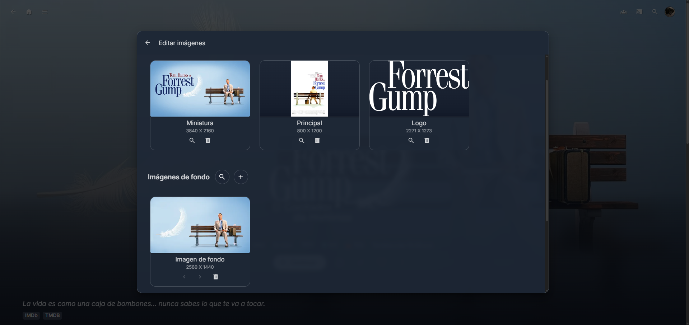
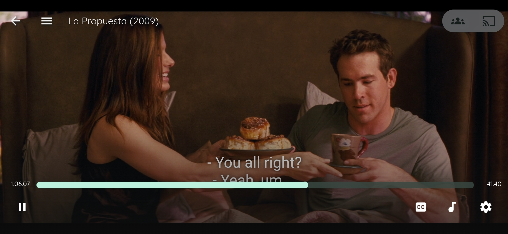
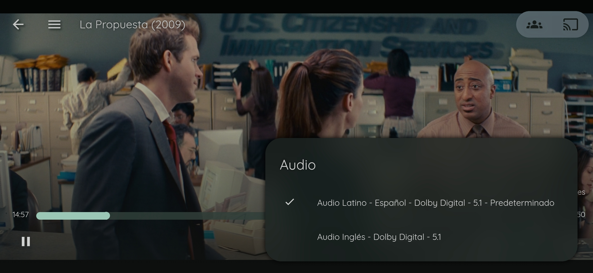

# Personal Home Media Server & Streaming Platform (QA Project)

## Overview
This project documents the design, configuration, and quality validation of a **personal home media server and streaming platform** using **Jellyfin**.  
The focus of the project is not only on setup, but on **functional, compatibility, and quality testing** across multiple devices, formats, and network conditions, applying a **QA engineering mindset**.

The platform enables secure **local and remote streaming** of personal media content (movies, videos, images) with attention to **playback stability, audio/video quality, and reliability under load**.

---

## Project Objectives
- Deploy a self-hosted media streaming server for personal content
- Enable secure local and remote access using VPN
- Validate media compatibility across devices and browsers
- Perform audio/video quality and synchronization testing
- Identify performance bottlenecks under concurrent usage
- Prepare the architecture for future migration to a NAS-based solution

---

## System Architecture

- **Server:** Personal PC (planned migration to NAS)
- **Media Server:** Jellyfin
- **Network Configuration:**
  - Static local IP
  - Port forwarding
  - VPN-based remote access using **Tailscale**
- **Access Modes:**
  - Local network streaming
  - Remote streaming via VPN

---

## Media & Format Support Tested

### Video & Image Formats
- Containers: **MKV, MP4**
- Codecs: **HEVC (H.265)**
- Resolutions tested: **480p → 4K**
- Image visualization: **JPG**

### Audio Formats
- Stereo
- AAC
- AC3
- E-AC3
- DTS
- 5.1 Surround

### Subtitles
- Embedded subtitles
- Subtitle synchronization validation

---

## Testing Scope & Strategy

### Functional Testing
- Media ingestion and library indexing
- Playback start/stop behavior
- Resume playback
- Subtitle enable/disable
- Audio track selection
- Metadata retrieval and display

### Compatibility Testing
Tested across multiple devices and platforms:

**Smart TVs & Streaming Devices**
- Hisense TV
- Firestick TV
- Sony Bravia (remote household)

**Mobile Devices**
- Samsung Galaxy phones (Android)

**Browsers**
- Google Chrome (latest)
- Mozilla Firefox (latest)

### Performance & Reliability Testing
- Concurrent streaming from multiple devices
- Observation of buffering behavior under load
- Playback stability during bandwidth contention
- Network condition variability (local vs VPN access)

_Result:_  
System remained stable under concurrent usage, with **expected performance degradation** (slight slowdown) when multiple streams were active — documented as a known limitation.

### Audio & Video Quality Validation
- Bitrate stability
- A/V synchronization
- Resolution switching
- Audio format consistency across devices

---

## Plugins & Customization
- Metadata enrichment using movie and TV databases
- Automatic media organization
- Skip Intro functionality
- Custom UI styling via CSS plugins

---

## QA-Focused Findings
- Identified performance impact during concurrent streaming
- Validated codec compatibility across heterogeneous devices
- Confirmed VPN reliability for remote access
- Detected minor buffering under higher-resolution streams (4K) when multiple clients were connected
- Improved configuration reliability through iterative testing

---

## Future Improvements
- Migrate server storage to a **NAS-like Ethernet-connected solution**
- Add persistent storage redundancy
- Expand stress testing scenarios
- Automate playback validation checks where feasible
- Add monitoring for bandwidth and server load

---

## Skills Demonstrated

### QA & Testing
- Functional testing
- Compatibility testing
- Performance and reliability testing
- Audio/Video quality validation
- Test scenario design
- Defect observation and root-cause analysis

### Technologies & Tools
- Jellyfin Media Server
- Networking (Static IP, Port Forwarding)
- VPN: **Tailscale**
- Media codecs and formats
- Browser-based testing (Chrome, Firefox)
- Smart TV and mobile device testing

### Engineering Mindset
- System reliability improvement
- Configuration validation
- Scalability planning
- Cross-device user experience testing

---

## Screenshots
### Jellyfin General Dashboard

### Media Details & Metadata

### Playback on Mobile Device

### Subtitles & Audio Track Selection

---

## Author
**Diego Adán Ambriz Ambriz**  
QA / Test Engineer  
